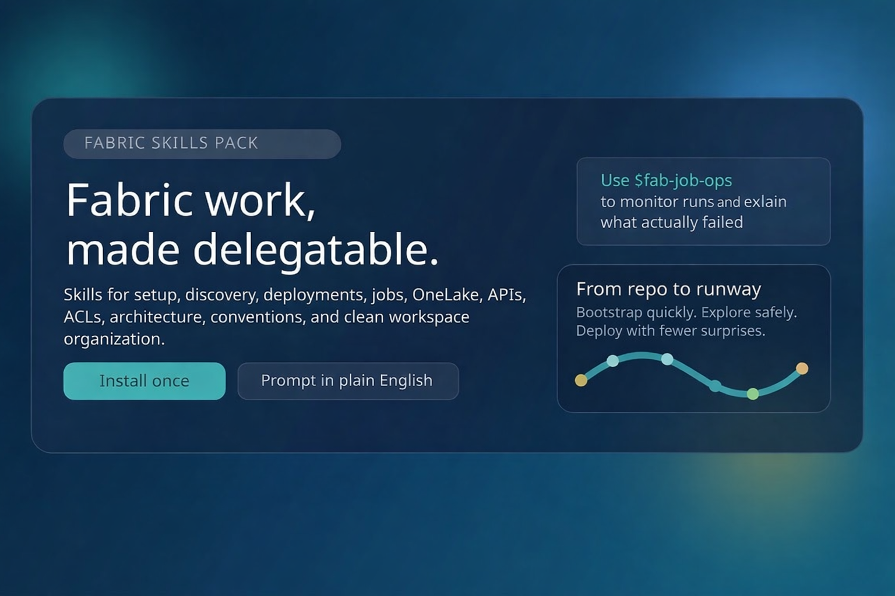
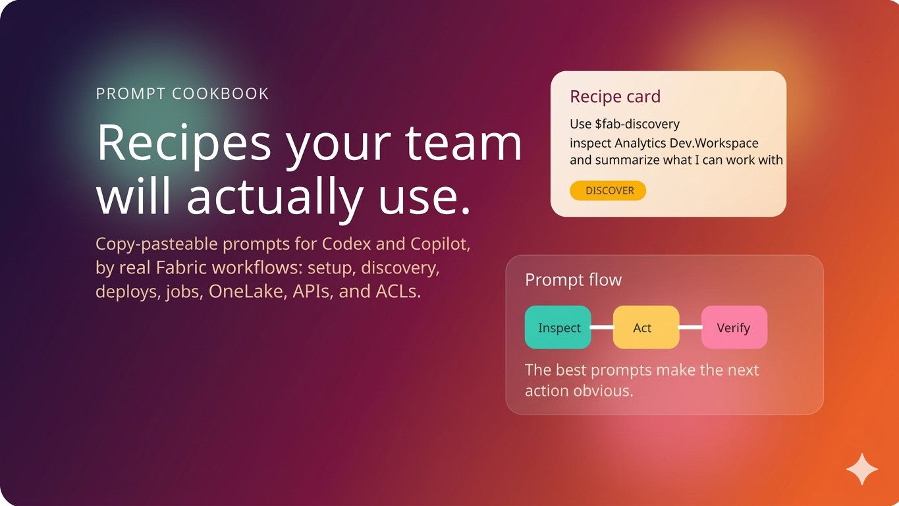

# Fabric Skills Pack

<p align="center">
  
</p>

<p align="center">
  <strong>Practical Microsoft Fabric skills for Codex and GitHub Copilot.</strong><br>
  Built for teams working with <code>fab</code>, deployments, jobs, OneLake, ACLs, APIs, and workspace design.
</p>

<p align="center">
  <a href="#quick-start"><strong>Quick Start</strong></a> ·
  <a href="#skill-lineup"><strong>Skill Lineup</strong></a> ·
  <a href="#how-to-prompt"><strong>How to Prompt</strong></a> ·
  <a href="docs/prompt-cookbook.md"><strong>Open the Cookbook</strong></a>
</p>

---

## Why This Repo Hits Different

This is not a random bundle of prompts. It is a working Fabric operator pack for AI assistants.

Instead of teaching the assistant Fabric from scratch in every chat, you install a focused set of skills once and then delegate work in plain English:

- bootstrap `fab` and repair setup issues
- inspect workspaces, items, and paths before making mistakes
- promote notebooks and pipelines with safer deployment flow
- run, monitor, and explain failed jobs
- inspect OneLake content and path structure
- bridge into Fabric REST APIs when first-class commands are not enough
- audit ACLs before touching permissions
- assess architecture, naming, and workspace organization

<table>
  <tr>
    <td width="33%" valign="top">
      <h3>Install Once</h3>
      <p>Drop the skills into Codex or Copilot and keep the setup consistent across your team.</p>
    </td>
    <td width="33%" valign="top">
      <h3>Prompt Naturally</h3>
      <p>Ask for Fabric work the way you would ask a strong teammate who already knows the platform.</p>
    </td>
    <td width="33%" valign="top">
      <h3>Operate Safer</h3>
      <p>Use discovery, dry runs, checks, and workflow guardrails instead of improvising in production.</p>
    </td>
  </tr>
</table>

---

## Quick Start

### Codex

Windows:

```powershell
git clone <your-repo-url> fab-cli-skills
cd fab-cli-skills
.\scripts\install.ps1
```

macOS:

```bash
git clone <your-repo-url> fab-cli-skills
cd fab-cli-skills
bash ./scripts/install.sh
```

### GitHub Copilot

Windows:

```powershell
git clone <your-repo-url> fab-cli-skills
cd fab-cli-skills
.\scripts\install-copilot.ps1
```

macOS:

```bash
git clone <your-repo-url> fab-cli-skills
cd fab-cli-skills
bash ./scripts/install-copilot.sh
```

### After Install

1. Restart Codex or Copilot if it is already open.
2. Start a new chat.
3. Ask for a Fabric task in plain English.

> Fast first win: open the [Prompt Cookbook](docs/prompt-cookbook.md) and copy a prompt that matches the job in front of you.

---

## Skill Lineup

<table>
  <tr>
    <td width="50%" valign="top">
      <h3>Platform Operations</h3>
      <p><code>fab-bootstrap</code> installs <code>fab</code>, repairs PATH, verifies setup, and launches user login.</p>
      <p><code>fab-discovery</code> explores workspaces, items, paths, and supported commands.</p>
      <p><code>fab-job-ops</code> starts jobs, inspects runs, polls status, and summarizes failures.</p>
      <p><code>fab-onelake-ops</code> works with OneLake files, folders, tables, and paths.</p>
      <p><code>fab-api-bridge</code> uses <code>fab api</code> for direct REST workflows.</p>
      <p><code>fab-acl-audit</code> inspects access and prepares safe ACL changes.</p>
    </td>
    <td width="50%" valign="top">
      <h3>Delivery and Design</h3>
      <p><code>fab-deploy</code> exports, imports, and promotes Fabric items safely.</p>
      <p><code>fab-conventions</code> defines, assesses, and safely applies naming and architecture conventions.</p>
      <p><code>fab-workspace-architecture</code> designs and audits single-workspace or per-stage workspace patterns with medallion structure.</p>
      <p><code>fab-workspace-organize</code> creates folders, cleans legacy clutter, and organizes single-workspace or stage-based layouts safely.</p>
    </td>
  </tr>
</table>

---

## How to Prompt

### In Codex

Use `$skill-name` in your prompt.

```text
Use $fab-bootstrap to install Fabric CLI and help me log in with user auth.
```

```text
Use $fab-job-ops to inspect the latest run of pl-main.DataPipeline and summarize failures.
```

### In GitHub Copilot

Use `/skill-name` in your prompt.

```text
Use the /fab-bootstrap skill to install Fabric CLI and help me log in with user auth.
```

```text
Use the /fab-deploy skill to promote a notebook from Analytics Dev to Test123.
```

### The Pattern That Works Best

Strong prompts usually include:

- the skill name
- the exact Fabric path or workspace
- the action you want
- the safety bar you expect, such as inspect first, dry run first, or do not execute yet

Example:

```text
Use $fab-acl-audit to inspect the current ACLs on Test123.Workspace, summarize who has access, and render the safest command to grant Viewer to a user without executing it yet.
```

---

## Prompt Cookbook

The cookbook is designed as a prompt gallery, not a wall of text.

<p align="center">
  <a href="docs/prompt-cookbook.md"></a>
</p>

It includes copy-pasteable prompts for:

- setup and login
- workspace discovery
- deployments
- jobs and monitoring
- OneLake inspection
- API workflows
- permission reviews
- architecture assessment

Recommended first prompts:

```text
Use $fab-bootstrap to check whether Fabric CLI is installed, fix PATH if needed, and help me log in with user auth.
```

```text
Use $fab-discovery to inspect my Fabric workspace and summarize what I can work with.
```

Open it here: [docs/prompt-cookbook.md](docs/prompt-cookbook.md)

---

## For Skill Authors

This repo also includes the same basic skill-authoring helpers used by Codex `skill-creator`.

```powershell
python .\scripts\init_skill.py my-new-skill --path .\skills --resources references
python .\scripts\quick_validate.py .\skills\my-new-skill
python .\scripts\generate_openai_yaml.py .\skills\my-new-skill --interface default_prompt="Use $my-new-skill to do the task."
```

See [docs/openai-yaml.md](docs/openai-yaml.md) for the local `agents/openai.yaml` rules.

---

## Update Flow

When this repo changes, pull and reinstall.

Windows:

```powershell
git pull
.\scripts\install.ps1
```

macOS:

```bash
git pull
bash ./scripts/install.sh
```

For GitHub Copilot, use the corresponding `install-copilot` script instead.

---

## Install Locations

<details>
  <summary><strong>Codex</strong></summary>

- Windows: `.codex\skills` under your user profile
- macOS: `.codex/skills` under your home directory
- If `CODEX_HOME` is set: `skills` under `CODEX_HOME`

</details>

<details>
  <summary><strong>GitHub Copilot</strong></summary>

- Windows: `.copilot\skills` under your user profile
- macOS: `.copilot/skills` under your home directory

</details>

The install scripts copy the skills from this repo into the correct local skills directory.

---

## Notes

- These skills are designed for user-auth-based Fabric workflows.
- `fab auth login` still requires browser interaction.
- The helper scripts are included inside the skill folders and are installed automatically with the skills.

---

## Team Rollout

The simplest rollout looks like this:

1. Share this repo with the team.
2. Have each teammate run one install script.
3. Point everyone at the cookbook for their first real task.

That gives the team the same setup, the same helper scripts, and the same usage patterns with much less reinvention.
